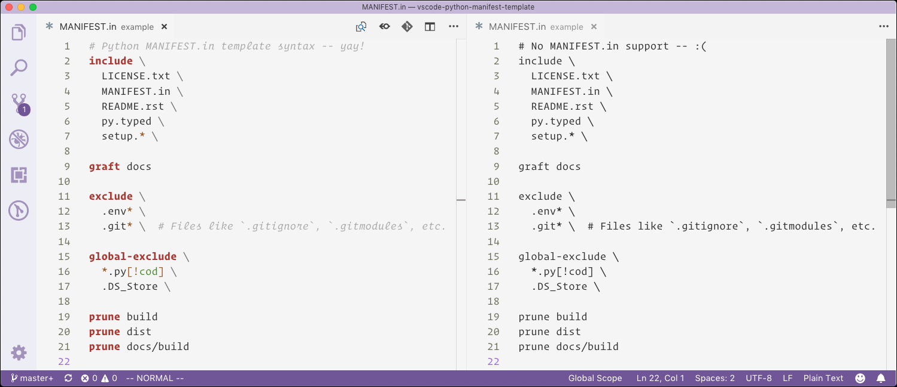

# Python `MANIFEST.in` extension for Visual Studio Code

A [Visual Studio Code][1] [extension][2] with support for Python manifest
templates, e.g. `MANIFEST.in`.



The Python manifest template has always been tricky to deal with. First you
have to get the right configuration between all of the involved bits, such as
`setup.py`, `setup.cfg`, and `MANIFEST.in`. Then you then need to play
whack-a-mole testing your distribution *or* — actually probably **and** —
take a very deep dive into `distutils` and `setuptools` code to figure out
the nuance of the six template commands for including and excluding files.

Hopefully between the syntax, snippets, and documentation (below) your pain
will lessen.

## Do I need a `MANIFEST.in`?

That is a good question! More and more the answer is, “Possibly not.” There
are various `setuptools` extensions like [`setuptools_scm`][3] that can
leverage your version control for tracking files to include and exclude.
There are also complete build system replacements, such as [`flit`][4].

However, you may still need a `MANIFEST.in`.

- You may be unable or unwilling to use a build system other than `setuptools`.
- Your project may be so simple that you don’t want to bother with another
  dependency for version control integration.
- Your project may be so complex that version control integration does not
  fully meet your needs. You may be generating untracked files that need to
  be included, or need to exclude tracked files.

## The `MANIFEST.in`

If you do need a `MANIFEST.in` we are going to try to make it hurt less. They
can be tough because first you have to get the right configuration between
all of the involved bits, such as `setup.py`, `setup.cfg`, and `MANIFEST.in`.
Then you then need to play whack-a-mole testing your distribution *or* —
actually probably **and** — take a very deep dive into `distutils` and
`setuptools` code to figure out the nuance of the six template commands for
including and excluding files.

Look at the included `example` directory to see an documented example of a
Python package with a `MANIFEST.in`.

### Commands

There are eight commands that take one, two, or more shell-style patterns.

Add | Remove | Arguments | Anchored
--- | --- | --- | ---
`include` | `exclude` | file-pattern1 [file-patternN] | ✔
`global-include` | `global-exclude` | file-pattern1 [file-patternN] | ✘
`recursive-include` | `recursive-exclude` | dir-pattern file-pattern1 [file-patternN] | ✔ dir pattern <br>✘ file patterns
`graft` | `prune` | dir-pattern | ✔

The order of the commands in your template file matters. I recommend doing
includes first, then excludes, going from most specific to most general.

1. `include`s
2. `global-include`s
3. `recursive-include`s
4. `graft`s
5. `exclude`s
6. `global-exclude`s
7. `recursive-exclude`s
8. `prune`s

*Remember:* You only need to exclude files get added to the list by default or
*with your include commands -- *you do not need to fully mirror your
*`.gitignore` with exclude commands.

#### Anchoring

If a pattern is *anchored* that means it must match the root of the project
precisely. For example, given these files:

```
.
├── LICENSE.txt
└── things
    └── LICENSE.txt

```

- The command `include LICENSE.txt` would add `LICENSE.txt` but miss `things/LICENSE.txt`.
- The command `global-include LICENSE.txt` would add any `LICENSE.txt` found in the tree.

Thus you want to be certain to use a `global-exclude` to keep out unwanted
files that get strewn about everywhere:

```python-manifest-template
global-exclude *.py[cod]
global-exclude .DS_Store
```

### Shell-style glob patterns

Glob | Becomes regex | Matches | Example
--- | --- | --- | ---
`*` | `[^/]*` | Match 0 or more anything but a path seperator, e.g. `/` | `*.txt`
`?` | `[^/]` | Match 1 of anything but a path seperator, e.g. `/` | 
`**` | `.*` | Match anything, including path seperators. | `src/**/templates`
`[seq]` | `[seq]` | Match any character within; ranges are valid. | `step-[0-9].png`
`[!seq]` | `[^seq]` | Match anything *except* a character within; ranges are valid. | `[!0-9]`

> *Note:* Older versions of Python did not support the globstar (`**`). While
> it is a wonderful addition in newer version of Python and `setuptools`, it
> can still take some playing with to get the result you want, particularly
> with `graft` and `prune`.

### Other syntax

- Leading and trailing whitespace are irrelevant.
- Comments are an `#` not escaped with a `\`, i.e., `\#` would not start a comment.
- Lines can be continued using a `\`.

### Examples

An example of some syntax is useful:

```python-manifest-template
include LICENSE.txt

# If you need a literal special glob character, put it in a sequence.
include myfile[?].txt

# To match a literal hash, escape it.
include my\#file.txt

graft docs

global-exclude \
  *.py[cod] \  # Comments after line continuations are valid.
  # And between line continuations as well!
  .DS_Store \  # Last item can have a line continuation as well, as long as the next line is blank.

prune docs/build
```

For a real-world example, have a look at the included [`example/MANIFEST.in`](example/MANIFEST.in).

### Other resources

- [`setuptools` docs][5]
- [`distutils` docs][6], and [more docs][7]


[1]: https://code.visualstudio.com/
[2]: https://marketplace.visualstudio.com/VSCode 

[3]: https://pypi.org/project/setuptools_scm/
[4]: https://pypi.org/project/flit/

[5]: https://setuptools.readthedocs.io/en/latest/setuptools.html
[6]: https://docs.python.org/3/distutils/sourcedist.html#specifying-the-files-to-distribute
[7]: https://docs.python.org/3/distutils/commandref.html#sdist-cmd
